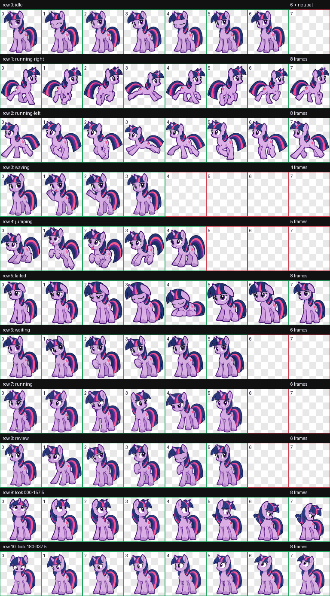

# TwilightSparkle Codex Pet（暮星）

一个受《小马宝莉》中暮光闪闪启发的 Codex v2 动画桌面宠物。



## 特性

- 9 组标准动画：待机、左右奔跑、挥蹄、跳跃、失败、等待、工作中和审阅
- 16 个连续注视方向
- `1536 × 2288`、8 × 11 格的 v2 WebP 精灵图
- 透明背景，并通过图集、方向和动画 QA

## 安装

### macOS / Linux

需要 Git 和支持自定义宠物的 Codex 桌面版。

```bash
git clone https://github.com/NeuStr-Ynu/TwilightSparkle-codex-pet.git
mkdir -p ~/.codex/pets/duskstar
cp TwilightSparkle-codex-pet/pet.json ~/.codex/pets/duskstar/
cp TwilightSparkle-codex-pet/spritesheet.webp ~/.codex/pets/duskstar/
```

### Windows PowerShell

```powershell
git clone https://github.com/NeuStr-Ynu/TwilightSparkle-codex-pet.git
New-Item -ItemType Directory -Force "$HOME\.codex\pets\duskstar"
Copy-Item "TwilightSparkle-codex-pet\pet.json" "$HOME\.codex\pets\duskstar\"
Copy-Item "TwilightSparkle-codex-pet\spritesheet.webp" "$HOME\.codex\pets\duskstar\"
```

复制完成后重启 Codex 桌面应用，然后在宠物选择器中选择「暮星」。如果你的 Codex 版本没有宠物选择器，请先更新应用。

## 手动安装

最终目录结构应为：

```text
~/.codex/pets/duskstar/
├── pet.json
└── spritesheet.webp
```

`pet.json` 中的 `spriteVersionNumber` 必须保持为 `2`。

## 卸载

删除 `~/.codex/pets/duskstar`，然后重启 Codex。

## QA 文件

`qa/` 保存了联系表、16 方向预览、图集校验和盲测结果，方便审查动画完整性。

## 许可与声明

代码和仓库原创文件以 [MIT License](LICENSE) 开源。

这是一个非官方、非商业的同人项目，与 Hasbro、Entertainment One、My Little Pony 或 OpenAI 均无隶属或背书关系。“My Little Pony”及“Twilight Sparkle”等名称和角色权利归其各自权利人所有。请勿将本项目用于暗示官方授权、销售相关素材或其他可能侵犯第三方权利的用途。
